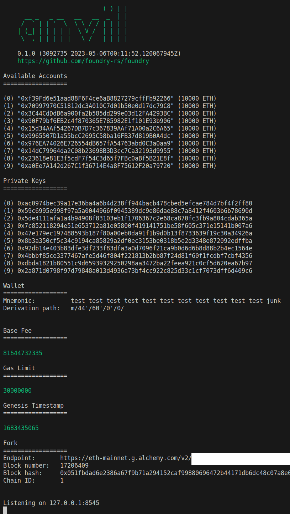

# Foundry Template Demo

See [TEMPLATE_README.md](./TEMPLATE_README.md) for instructions on using the foundry template ([original source](https://github.com/PaulRBerg/foundry-template)).<br>

# Fork Mainnet
`anvil --fork-url $API_URL_ALCHEMY`<br>



***
# Query Mainnet

```
00:26:37::jason@lima-jg-03::foundry-template-demo (main) $ cast block-number --rpc-url $API_URL_ALCHEMY
17206587
```
<br>

# Contract Validation
Check to see if [this contract](./src/MyCon.sol) is valid.

```js
contract MyCon {
    function a(
        function(
            function(
                function(
                    function(
                        function(
                            function(
                                function(
                                    function(
                                        function() external pure
                                    ) external pure
                                ) external pure
                            ) external pure
                        ) external pure
                    ) external pure
                ) external pure
            ) external pure
        ) external pure
    ) external pure {}
}
```

`forge build`

```
[⠒] Compiling...
[⠢] Compiling 1 files with 0.8.19
[⠰] Solc 0.8.19 finished in 11.30ms
Compiler run successful!
```